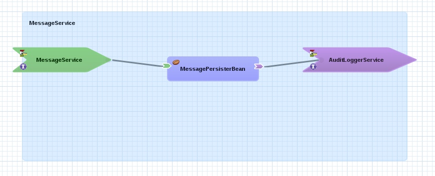
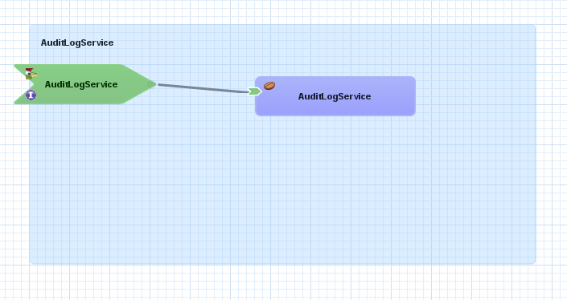

:data-uri:
:docker: link:https://www.docker.com[Docker]
:docker-volume-container: link:https://docs.docker.com/userguide/dockervolumes/[Docker Volume Container]

image::images/rhheader.png[width=900]

:numbered!:
[abstract]
== Red Hat GPE Reference Architecture:  FSW with an external JMS Broker Cluster

:numbered:

== Overview

This reference architecture provides a detailed example of how to configure and use Fuse Service Works with an external JMS broker cluster.

Messaging provides a vital component to many application architectures. The decoupled and asynchronous nature of messaging as a means of communication between systems or system components has numerous benefits, including:

. *Decoupling* - The two systems can be extended and modified independently as long as they adhere to the same interface requirements.  The JMS API provides
a well-known interface allowing for significant flexibility for how the two connected systems may be managed.
. *Redundancy* - The message may be held safely in the queue until the receiver is able to process the message without errors.  The queue safely holds onto
the request in the message until the the process explicitly indicates that the message has been received and processed.
. *Scalability* - Scaling with JMS is straight-forward.  If messages are being processed too slowly, simply add more processes to receive and process the messages.
. *Resiliency* - If the message receiving process fails, crashes, or is just down for maintenance, the decoupling provided by the JMS interface allows the message
producer to continue, unharmed by the the issues on consumer.
. *Delivery Guarantees* - The redundancy provided by JMS means that message delivery is guaranteed.  In many cases, queues are configured to be durable; their state
is even guaranteed to survive a server crash on the JMS broker, because messages are saved to a storage device.
. *Ordering Guarantees* - Various options are available for controlling the ordering of messages received from a queue, however the most common configuration is to provide the messages in FIFO order (First In, First Out).
. *Buffering* - In situations where messages are produced at a faster rate than consumed, the JMS broker is capable of buffering the messages until ready for consumption.

Most JMS brokers can be set up as a cluster to provide load-balancing and high-availability functionality. Two or more brokers can be grouped together to share messaging processing load and load balance messages over the nodes of the cluster. High-availability ensures that in case of failure of a broker, another broker instance takes over the responsibilities of the failed node, including transparent fail-over of client connections.

Fuse Service Works runs on top of JBoss EAP, which includes the HornetQ JMS broker. This means that FSW applications can leverage the embedded HornetQ broker for communication between application components and external systems. However there are some good reasons to use an external broker, rather than the embedded one:

. *Separation of Concerns* - The JMS brokers are treated as just another layer of the infrastructure, just like the database. An external or standalone broker will be often be easier to setup, tune and maintain  
. *Reuse* - If several applications or system leverage messaging require messaging capabilities, it makes sense to have a common messaging infrastructure shared by multiple systems 
. *Choice* - Requirements, existing skills and expertise and/or functionality might drive the decision to use a broker different than the embedded one (e.g. ActiveMQ instead of HornetQ). This requires the broker to support JMS, and to provide a CA resource adapter for integration with the FSW application server. 
. *Independent scaling* - The applications and the message brokers can be scaled out independently. The high-performance nature of JMS brokers like HornetQ typically require less resources and scale-out requirements than the applications they serve. 

In this reference architecture we will configure a HornetQ cluster of two nodes, where each node also acts as a backup for the other node for high-availability. This JMS cluster will be used by a cluster of two (or more) FSW nodes, on which an application is deployed whose components communicate over JMS queues. Using this setup we can demonstrate the load-balancing and fail-over characteristics of the HornetQ JMS cluster, as well as the transactional nature of the JMS interactions.

== Architecture

=== Docker

This reference architecture requires at least 4 JVM processes to run, as well as supporting services (shared file system for HornetQ journal, database for FSW and FSW application). We opted for {docker} container technology to be able to run all these processes on one one physical or virtual machine, while still providing adequate process and network isolation between the different processes.
Docker leverages Linux Container technology, and runs on any Linux system with a recent kernel version (version 3.8 or above), like RHEL 7 or Fedora 20. If you want to test this reference architecture on another operating system like MacOSX or Windows, you can run Docker inside a virtual machine. Please refer to the {docker} web site for more information and how-to's. 

In this reference architecture we'll build and run 6 containers in total:

* 1 container to hold the shared file system for the HornetQ brokers
* 1 container for the MySQL database, used by FSW and the test application
* 2 containers for the HornetQ broker cluster
* 2 containers for the FSW cluster

=== HornetQ Cluster

Strictly speaking, HornetQ is not a standalone JMS broker, as it runs on top of JBoss EAP. So when we speak about a HornetQ cluster, we actually mean a cluster of JBoss EAP instances, on which the HornetQ broker is configured to form a JMS broker cluster.

In this reference architecture, the HornetQ brokers are configured as _symmetrical live backup_ cluster. This means that we have a cluster of two nodes, where each node has a live broker, and the backup broker for the other node. All nodes are interconnected through cluster connections. +
This setup provides for:
* Load-balancing: the cluster connections between the brokers ensure that messages can be load balanced between the nodes of the cluster. By default, the messages will be distributed in a round-robin fashion between the nodes of the cluster (as long as these nodes have consumers for these messages).
* Fail-over: in case of failure of one of the nodes, the backup broker on the other node will take over from the failed live broker. Once the failed live broker is restored, it will resume activity from the backup broker. Fail-over is transparent for clients (producers and consumers): the client library code detects the failure of the live node and reconnects the client to the backup node transparently.

Individual brokers form a cluster by defining cluster connections between them. HornetQ provides dynamic and static cluster connections. Dynamic cluster connections rely on UDP broadcasting for brokers to broadcast their existence and discover their peers and form cluster connections. The reference architecture uses this mechanism. In situations where UDP cannot be leveraged, static lists of servers connectors can be used. The dynamic discovery is more flexible, easier to automate and allows for easy adding or removing new nodes to the cluster.

In HornetQ, fail-over is implemented using live-backup groups, where a live broker has one (or more) backup brokers. Backup brokers are not operational until fail-over occurs. Before fail-over, only the the live server is serving HornetQ clients while the backup broker remains passive. When the live broker crashes, the backup server becomes live. If the live server is configured for automatic fail-back, when it is restarted after a fail-over it become the live server again while the backup node will stop and become passive again.

HornetQ fail-over relies on the fact that the live and backup nodes in the same live-backup group share the same persistence journal. HornetQ supports two strategies for sharing the journal: _shared store_ and _journal replication_. This reference architecture uses the shared journal strategy. In this strategy, both live and backup brokers share the same data directory using a shared file system. HornetQ supports GFS2 on a Storage Area Network and NFSv4. In the reference architecture, we use a {docker-volume-container} to provide a file system shared by the HornetQ live-backup groups.

=== Fuse Service Works

Fuse Service Works (FSW) is configured to use the HornetQ cluster for JMS messaging. FSW relies on the JMS subsystem configuration of the underlying EAP server. In our configuration, the JMS connection factory and the resource adapter managed connection pool use dynamic discovery using UDP to discover the HornetQ brokers. In situations where UDP cannot be used, the JMS connection factory and connection pool can be configured with a static list of remote HornetQ brokers.

Fuse Service Works offers two gateways to leverage JMS: _JCA gateway_ and _JMS gateway_. The JMS gateway is built upon the camel-jms component, while the JCA gateway uses a JCA resource adapter to send or receive messages from a EIS. In this reference architecture we chose JCA, as it provides a better intergration with the underlying application server and its transaction manager.

=== Fuse Service Works Test Application

To demonstrate message load-balancing, transparent JMS client fail-over and transactional message processing, a test application is deployed on the Fuse Service Works nodes. This application consists of two separate SwitchYard applications (or _composites_) packaged together in an ear file.

The MessageService composite listens to the MessageService queue over the JCA binding, and expects a text message. When a message is consumed from the queue, the service implementation persists the contents of the message with the node identifier and a time-stamp to the MySQL database. The message is then forwarded to the AuditLoggerService reference. This reference is bound to the AuditLogService queue, so the net result is that a new message with the same content is posted on that queue. The message consumption, persistence and the posting of the message happen in one transaction.

The AuditLogService composite fetches messages from the AuditLogService queue, and persists the message content, with the node identifier and the timestamp in another table of the MySQL database. During tests with the reference architecture we can check the database tables to verify load-balancing of the messages, and correct behavior in the case of failure of a HornetQ node, or one of the FSW nodes.

=== Client application

In order to test the reference architecture, a client application is provided that will post a number of messages to one of the HornetQ broker nodes. 

== Prerequisites

The remainder of this documentation provides instructions for installation, configuration and execution of this reference architecture.  
The following is a list of pre-requisites:

. Java JDK 1.7
. maven 3.0.5 (or greater)
. git client
. {docker}
. JBoss EAP 6.1.1.GA. JBoss EAP can be downloaded from the RedHat customer support portal. We will use version 6.1.1.GA for the HornetQ servers to be aligned with the EAP version on which Fuse Service Works runs. Download URL https://access.redhat.com/jbossnetwork/restricted/softwareDownload.html?softwareId=24143&product=appplatform. The archive name is `jboss-eap-6.1.1.zip`.
. Fuse Service Works. The Fuse Service Works installer can be downloaded from the Red Hat customer support portal. The download URL is https://access.redhat.com/jbossnetwork/restricted/softwareDownload.html?softwareId=27523&product=jboss.fuse.serviceworks. The artefact name is `jboss-fsw-installer-6.0.0.GA-redhat-4.jar`.

If the reference architecture is tested on a platform that does not provide {docker} support, we recommend to run it on a virtual machine with a suitable OS (e.g. Fedora 20 or RHEL7). In this case all instructions will have to be executed on the virtual machine.

== Configuration and deployment

=== Clone the reference architecture

To clone the reference architecture to your local environment, execute the following command:

----
$ git clone https://github.com/jboss-gpe-ref-archs/fsw-jms-cluster.git.
----

Doing so will create a directory in your local computer called:  fsw-jms-cluster.
For the purposes of this documentation, this directory will be referred to as $REF_ARCH_HOME.

=== Build applications

The first step is to build the two applications required for this reference architecture: the FSW test application, and the client application. Both applications are built with maven.

To build the FSW test application:

----
$ cd $REF_ARCH_HOME/serviceTier
$ mvn clean package
----

To build the client application:

----
$ cd $REF_ARCH_HOME/hornetq-client
$ mvn clean package 
----

=== Build Docker images

The next step is to build the Docker containers for this reference architecture. All containers start from a publicly available fedora 20 image (_mattdm/fedora:f20_). 

Docker requires root access, so all docker operations need to be executed as root.

==== HornetQ Data Volume container
 
This container will hold the shared file system for the HornetQ journals of the HornetQ brokers. The shared file system will e mounted on each of the HornetQ containers.

To build the image:

----
# cd $REF_ARCH_HOME/docker/hq-cluster-data
# docker build -t refarch/hq-data . 
---- 

==== HornetQ Broker Node container

This container runs a HornetQ server, configured to be part of a live-backup cluster. We will run two of these containers, where each container will run a live HornetQ broker, plus the backup broker for the live broker on the other container. All brokers are connected using cluster connections, which are dynamically configured using broadcast and discovery groups. 

As part of building the image, JBoss EAP version 6.1.1.GA will be provisioned and configured. Configuration of the EAP instance is done using a JBoss CLI script. 
The following scripts are used:

* $REF_ARCH_HOME/docker/hq-cluster/install-eap.sh : installation script for EAP.
* $REF_ARCH_HOME/docker/hq-cluster/configure-eap.sh : runs the JBoss CLI script `configure-hornetq.cli` to configure the HornetQ brokers.
* $REF_ARCH_HOME/docker/hq-cluster/configure-hornetq.cli : JBoss CLI script to configure the HornetQ live and backup brokers.
* $REF_ARCH_HOME/docker/hq-cluster/create-queues.sh : runs the JBoss CLI script `create-queues.cli`.
* $REF_ARCH_HOME/docker/hq-cluster/create-queues.cli : JBoss CLI script to create the queues for the test application.
* $REF_ARCH_HOME/docker/hq-cluster/start-eap.sh and $REF_ARCH_HOME/docker/hq-cluster/stop-eap.sh : scripts to start and stop EAP. Please note that the EAP instance will be started automatically when the Docker container is started.

An administration user (username admin, password admin) and an application user (username user, password user) are created as part of the provisioning.

Before building the Docker image, copy the EAP archive `jboss-eap-6.1.1.zip` to the `resources` folder:

----
# cp jboss-eap-6.1.1.zip $REF_ARCH_HOME/docker/hq-cluster/resources
# cd $REF_ARCH_HOME/docker/hq-cluster
# docker build -t refarch/hq-cluster .
----

==== MySQL database container

This container runs the MySQL instance that is used by FSW and the test application. Two schemas are created: `fsw` for Fuse Service Works, `refarch` for the test application. The scripts for creating the schemas are `$REF_ARCH_HOME/docker/mysql/create-schema.sh` and `$REF_ARCH_HOME/docker/mysql/create-app-schema.sh`. The `$REF_ARCH_HOME/docker/mysql/sql` directory contains the SQL scripts to create and populate the FSW database tables. The tables for the test application are created automatically when the FSW server starts up for the first time.

To build the image:

----
# cd $REF_ARCH_HOME/docker/mysql
# docker build -t refarch/mysql .
----

==== Fuse Service Works container

This container runs a Fuse Service Works instance. FSW is configured to use the HornetQ broker cluster and MySQL as the database for FSW itself and for the test application.

FSW is provisioned by running the FSW installer in unattended mode. After installation scripts are run to further configure FSW and deploy the test application.
The following scripts are used:

* $REF_ARCH_HOME/docker/fsw/configure-fsw.cli : JBoss CLI script for the configuration of the JMS subsystem.
* $REF_ARCH_HOME/docker/fsw/configure-fsw-refarch-app.cli : JBoss CLI to create the datasource and local queues.
* $REF_ARCH_HOME/docker/fsw/configure-fsw.sh : script to launch the `configure-fsw.cli` CLI script.
* $REF_ARCH_HOME/docker/fsw/deploy-refarch-app.sh : script to deploy the test application.
* $REF_ARCH_HOME/docker/fsw/install-fsw.sh : installation script for FSW
* $REF_ARCH_HOME/docker/fsw/manifests/fsw.xml and $REF_ARCH_HOME/docker/fsw/fsw.variables : configuration files for the FSW installer.
* $REF_ARCH_HOME/docker/fsw/start-fsw.sh and $REF_ARCH_HOME/docker/fsw/stop-fsw.sh : scripts to start and stop FSW. Please note that the FSW instance will be started automatically when the Docker container is started.

Although FSW is configured to use the remote HornetQ broker cluster, we still need to define a local queue for the AuditLogService of the test application. The outgoing JCA binding uses JNDI to look up the queue definition and does so in the local JNDI tree. But as the JMS connection factory points to the remote brokers, the local queue won't be used and instead messages are sent to the remote queue defined on the broker nodes.

An administration user (username admin, password admin123!) is created as part of the provisioning.

Before building the Docker image, copy the FSW installer `jboss-eap-6.1.1.zip` and the test application EAR archive to the `resources` folder:

----
# cp jboss-fsw-installer-6.0.0.GA-redhat-4.jar $REF_ARCH_HOME/docker/fsw/resources
# cp $REF_ARCH_HOME/serviceTier/service-ear/target/fsw-jms-cluster-service.ear $REF_ARCH_HOME/docker/fsw/resources
# cd $REF_ARCH_HOME/docker/fsw
# docker build -t refarch/fsw .  
----

== Running the reference architecture

=== Docker containers

Our Docker containers need to be started in a well-defined order. All Docker commands need to be executed as root.

==== HornetQ Volume container

----
# docker run -d --name="refarch-hq-data" refarch/hq-data
----

==== HornetQ cluster node containers

To run a cluster of HornetQ brokers, we will start two containers from the `refarch/hq-cluster` image.

----
# docker run -d --name="refarch-hq1" -e HORNETQ_NODE=hornetq1 -e HORNETQ_BACKUP_NODE=hornetq2 --volumes-from=refarch-hq-data refarch/hq-cluster
# docker run -d --name="refarch-hq2" -e HORNETQ_NODE=hornetq2 -e HORNETQ_BACKUP_NODE=hornetq1 --volumes-from=refarch-hq-data refarch/hq-cluster
----

The `--volumes-from refarch-data-hq` argument will mount the data volume defined in the volume container in the HornetQ node containers. The mounted filsystem, shared between the two nodes acts as our shared filesystem to hold the HornetQ persistence journals. The `HORNETQ_NODE` and `HORNETQ_BACKUP_NODE` environment variables passed to the containers differentiate the master and backup brokers on the HornetQ nodes and configures the journal directories.

==== MySQL database container

----
# docker run -d --name="refarch-mysql" refarch/mysql
----

==== Fuse Service Works containers

We will start 2 instances of the FSW container.

----
# docker run -d --name="refarch-fsw1" --link="refarch-mysql:mysql" refarch/fsw
# docker run -d --name="refarch-fsw2" --link="refarch-mysql:mysql" refarch/fsw
----

The `--link` argument links the FSW containers to the MySQL database container. This allows the FSW containers to access the network and environment of the MySQL container via environment variables. 

=== HornetQ client application

Now that all our Docker containers are running, we can use the HornetQ client application to send a number of JMS messages to the MessageService queue on one of the HornetQ broker hosts. These messages will be consumed by the FSW test application, and we will be able to verify load-balancing behaviour by inspecting the MySQL database tables.

The HornetQ client has a number of options to customize its behaviour. To see all the options, execute the client with the `--help` option.

----
$ cd $REF_ARCH_HOME/hornetq-client/target
$ java -jar hornetq-client-1.0.0.jar --help
 usage   : [OPTIONS]
 options : [--action consumer|producer] - send or receive messages; default producer
           [--host  .. ] Host name or IP address of the HornetQ broker; default 'localhost'
           [--port  .. ] Port for connection to the HornetQ broker; default '5445'
           [--destinationType queue|topic] type of the destination ; default queue
           [--destination ..] name of the destination ; default 'test'
           [--batchSize   N] - use send and receive transaction batches of size N; default 0, no jms transactions
           [--count       N] - number of messages to send or receive; default 100
           [--size        N] - size in bytes of a BytesMessage; default 0, a simple TextMessage is used
           [--text      .. ] - text to use when using a text message; default default 'Message'
           [--sleep       N] - millisecond sleep period between sends or receives; default 0
           [--persistent  true|false] - use persistent or non persistent messages; default true
           [--user      .. ] - connection user name; default 'user'
           [--password  .. ] - connection password; default 'user'
----

First we need to find out the IP address of one of the HornetQ brokers. This can be done with the Docker `inspect` command:

----
# docker inspect refarch-hq1 | grep IPAddress | cut -d '"' -f 4
172.17.0.4 
----

Use the IP address obtained to send 100 messages to the HornetQ broker (replace `172.17.0.4` with the correct IP address for the broker):

----
$ cd $REF_ARCH_HOME/hornetq-client/target
$ java -jar hornetq-client-1.0.0.jar --host 172.17.0.4 --destination MessageServiceQueue
----

=== Verify the results

We can now connect to the MySQL database to verify the number of rows created in the test application tables, as well as the distribution of messages processed on the FSW nodes. 

First we need to connect to the MySQL database. If you have a MySQL client running on your machine, we can connect from there.

We need the IP address of the MySQL container:

----
# docker inspect refarch-mysql | grep IPAddress | cut -d '"' -f 4
172.17.0.12
----

Now we can connect to MySQL (password is 'jboss'):

----
$ mysql -u jboss -p -h 172.17.0.12
Enter password: 
Welcome to the MariaDB monitor.  Commands end with ; or \g.
Your MariaDB connection id is 10
Server version: 5.5.38-MariaDB MariaDB Server

Copyright (c) 2000, 2014, Oracle, Monty Program Ab and others.

Type 'help;' or '\h' for help. Type '\c' to clear the current input statement.

MariaDB [(none)]> 
----

Alternatively, we can connect to MySQL from within the container. For this to work, we need a command prompt into our container. As our containers do not run a ssh daemon, we will use the `nsenter` utility to get to a prompt.

First we need to find the process id (PID) of the MySQL container:

----
# docker inspect --format '{{ .State.Pid }}' refarch-mysql
8908
----

Use the Pid to enter the container:

----
# nsenter -m -u -n -i -p -t 8908 /bin/bash
----

This will give us a root prompt in the container. Now we can conect to MySQL:

----
[root@3c4300f341ff /]# mysql -u jboss -p
Enter password: 
Welcome to the MariaDB monitor.  Commands end with ; or \g.
Your MariaDB connection id is 11
Server version: 5.5.38-MariaDB MariaDB Server

Copyright (c) 2000, 2014, Oracle, Monty Program Ab and others.

Type 'help;' or '\h' for help. Type '\c' to clear the current input statement.

MariaDB [(none)]>
----

Once we have a MySQL prompt, we can verify that we have 100 messages in the `message` table, as well as in the `auditlog` table:

----
MariaDB [(none)]> SELECT COUNT(*) FROM refarch.message;
+----------+
| COUNT(*) |
+----------+
|      100 |
+----------+
1 row in set (0.00 sec)

MariaDB [(none)]>
----

----
MariaDB [(none)]> SELECT COUNT(*) FROM refarch.auditlog;
+----------+
| COUNT(*) |
+----------+
|      100 |
+----------+
1 row in set (0.00 sec)

MariaDB [(none)]> 
----

We can verify that the messages consumed and sent by the test application were balanced over the two FSW nodes.

----
MariaDB [(none)]> SELECT node,COUNT(*) FROM refarch.message GROUP BY node;
+--------------------+----------+
| node               | COUNT(*) |
+--------------------+----------+
| server-172.17.0.13 |       54 |
| server-172.17.0.14 |       46 |
+--------------------+----------+
2 rows in set (0.01 sec)

MariaDB [(none)]> 
----

In this example, 54 messages were handled by the MessageService on node refarch-fsw1, 46 on node refarch-fsw2.

Similar for the auditlog table:

----
MariaDB [(none)]> SELECT node,COUNT(*) FROM refarch.auditlog GROUP BY node;
+--------------------+----------+
| node               | COUNT(*) |
+--------------------+----------+
| server-172.17.0.13 |       55 |
| server-172.17.0.14 |       45 |
+--------------------+----------+
2 rows in set (0.00 sec)

MariaDB [(none)]> 
----
=== Next steps

Now we can start experimenting with this setup, and see what happens if we shut down or kill a HornetQ node or a FSW node. To observe the behavior, you probably want to use the client application with a higher numer of messages than the default of 100 (by setting the `--count` parameter) so it runs long enough to allow manipulations on the servers. 

To simulate a crash of a server, you can kill the JVM process in the docker container. Enter the container with `nsenter` as explained above. Then, on the command prompt, find the PID of the java process, and send it a kill signal:

----
[root@0887cb24ede1 /]# ps aux | grep java
jboss       98  1.4  3.1 3429068 382188 ?      Sl   09:38   0:48 java -D[Standalone] -server -XX:+UseCompressedOops -Xms768m -Xmx768m -XX:MaxPermSize=256m 
-Djava.net.preferIPv4Stack=true -Djboss.modules.system.pkgs=org.jboss.byteman -Djava.awt.headless=true -Dorg.jboss.boot.log.file=/opt/jboss/hornetq/standalone/
log/server.log -Dlogging.configuration=file:/opt/jboss/hornetq/standalone/configuration/logging.properties -jar /opt/jboss/hornetq/jboss-modules.jar -mp /opt/
jboss/hornetq/modules -jaxpmodule javax.xml.jaxp-provider org.jboss.as.standalone -Djboss.home.dir=/opt/jboss/hornetq -Djboss.server.base.dir=/opt/jboss/
hornetq/standalone -Djboss.bind.address=172.17.0.10 -Djboss.bind.address.management=172.17.0.10 -Djboss.bind.address.insecure=172.17.0.10 -Djboss.node.name=
server-172.17.0.10 -Dhornetq.node=hornetq1 -Dhornetq.backup.node=hornetq2 --server-config=standalone-full.xml
root       331  0.0  0.0 112668  2256 ?        S+   10:34   0:00 grep --color=auto java
[root@0887cb24ede1 /]# kill -9 98
----

To start up the node again, from the container prompt:

----
[root@0887cb24ede1 /]# ./start-eap.sh
----

To do a controlled shut down, from the container prompt:

----
[root@0887cb24ede1 /]# ./stop-eap.sh
---- 

In case of a crash of a HornetQ node, the backup broker for the failed live broker takes over. Messages keep being delivered to the queues.The FSW client connections to the failed broker are tranparently redirected to the backup broker. No messages are lost. 

In case of normal shutdown of one of the brokers, fail-over does not happen. Messages that were still undelivered by the shut down broker are persisted in the journal. The HornetQ will have to be restarted to trigger delivery of those messages. This behaviour is set in the configuration of brokers, by setting the `failover-on-shutdown` parameter to `false` (see lines 15 and 47 in $REF_ARCH_HOME/docker/hq-cluster/configure-hornetq.cli). If this parameter is set to `true`, fail-over will also kick in when the broker is shut down normally.

When a failed broker is started up again, the live broker will take over from its backup. This behaviour is configured by setting the `allow-failback` parameter to `true`. If this parameter is set to false, the live broker will not take over again from its backup, but will act as the backup for the new live broker.  

